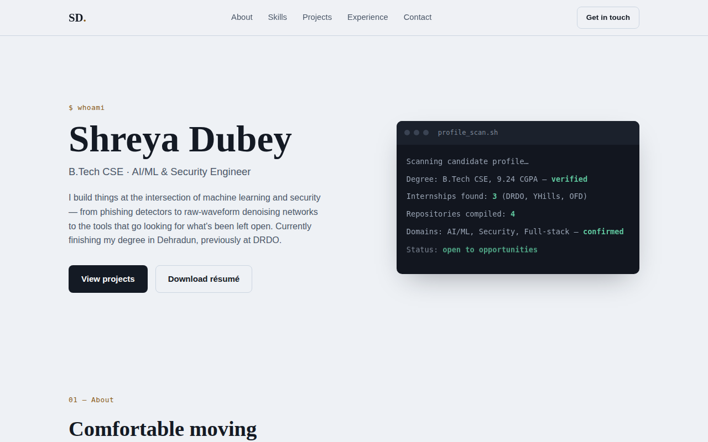

<div align="center">

# Hi, I'm Shreya Dubey 👋

### B.Tech CSE Graduate (2026) · AI/ML · Cybersecurity · Full-Stack

I build things across the stack — from denoising audio with neural nets to scanning networks for weak points to full CRUD apps. Currently graduating with a 9.24 CGPA and looking for full-time opportunities.

[](mailto:dubeyshreya1503@gmail.com)
[](https://www.linkedin.com/in/shreya-du1)
[](#)

</div>

---

<br>



<sub>⚠️ Preview rendered offline, so it's showing fallback system fonts instead of Fraunces/Inter/IBM Plex Mono — those load correctly once deployed with normal internet access.</sub>

<br>

### 🧭 About

- 🎓 B.Tech Computer Science, Uttaranchal University, Dehradun — graduating June 2026 (CGPA: 9.24)
- 🛰️ AI/ML Intern at **DEAL, DRDO** (Aug 2025 – Feb 2026)
- 🔐 Cybersecurity Intern at **YHills** (May – Jun 2024)
- 💻 Web Development Intern at **Ordnance Factory, Dehradun** (May – Jun 2023)
- 📍 Based in Dehradun, Uttarakhand, India

### 🛠️ Skills

**Languages**


**ML / Data**


**Tools & Databases**


**Foundations:** Data Structures & Algorithms · OOP · DBMS · Operating Systems · Computer Networks · Network Security

---

## ✨ What makes this different

Most portfolio templates default to one of two looks: cream-and-serif "editorial," or
near-black-with-neon "hacker." This one does neither — a cool **mist slate** palette
with a **warm signal-amber** accent (think oscilloscope phosphor, not Matrix green),
paired with **Fraunces** for display type and **IBM Plex Mono** for data.

The signature move: the **Skills section is literally formatted as port-scanner
output** —

```
PORT       STATE    SERVICE                              CATEGORY
3.11/py    open     Python                                Languages
torch/1    open     PyTorch                               AI / ML
sec/01     open     Network Security & Vuln. Assessment    Security
```

— a direct callback to the [Network Vulnerability Scanner](https://github.com/dshreya1503-stack/network-vulnerability-scanner)
project below it, not decoration for its own sake.

## 🧩 Sections

| Section | What's there |
|---|---|
| **Hero** | Name, role, and an animated "profile scan" terminal readout (respects `prefers-reduced-motion`) |
| **About** | Quick facts — location, CGPA, graduation date, focus areas |
| **Skills** | The scan-table shown above |
| **Projects** | All 4 shipped repos, each with tech tags and a live GitHub link |
| **Experience** | Chronological internship timeline — DRDO, YHills, Ordnance Factory |
| **Contact** | Email, GitHub, LinkedIn, and a résumé download |

## 🔗 Links used on this site

| Field | Value |
|---|---|
| Email | dubeyshreya1503@gmail.com |
| Phone | +91 74095 58351 |
| GitHub | [github.com/dshreya1503-stack](https://github.com/dshreya1503-stack) |
| LinkedIn | [linkedin.com/in/shreya-du1](https://www.linkedin.com/in/shreya-du1) |
| Résumé | `resume.pdf` (included in this repo) |

**Projects linked:**
- [Phishing_Detection_System](https://github.com/dshreya1503-stack/Phishing_Detection_System)
- [adaptive-noise-cancellation](https://github.com/dshreya1503-stack/adaptive-noise-cancellation)
- [network-vulnerability-scanner](https://github.com/dshreya1503-stack/network-vulnerability-scanner)
- [employee-management-dashboard](https://github.com/dshreya1503-stack/employee-management-dashboard)


### 🚀 Featured Projects

| Project | What it does | Stack |
|---|---|---|
| 🎣 [**Phishing Detection System**](https://github.com/dshreya1503-stack/Phishing_Detection_System) | ML classifier that flags phishing URLs from lexical/structural features — Random Forest vs Logistic Regression comparison | Python, scikit-learn, pandas |
| 🎧 [**Adaptive Noise Cancellation**](https://github.com/dshreya1503-stack/adaptive-noise-cancellation) | Speech enhancement comparing DAE, U-Net, and Wave-U-Net — built on a from-scratch NumPy autograd engine (no PyTorch available in build environment) | Python, NumPy |
| 🛡️ [**Network Vulnerability Scanner**](https://github.com/dshreya1503-stack/network-vulnerability-scanner) | Multithreaded TCP port scanner with banner grabbing and vulnerability heuristics — console/JSON/HTML reports | Python, sockets |
| 👥 [**Employee Management Dashboard**](https://github.com/dshreya1503-stack/employee-management-dashboard) | Full-stack CRUD app with RBAC, CSRF protection, and a Chart.js analytics dashboard | PHP, MySQL, Bootstrap |

---

### 📊 GitHub Stats

<div align="center">
  
  
</div>

---

<div align="center">
<sub>Open to full-time roles in AI/ML, cybersecurity, or software development — feel free to reach out.</sub>
</div>
